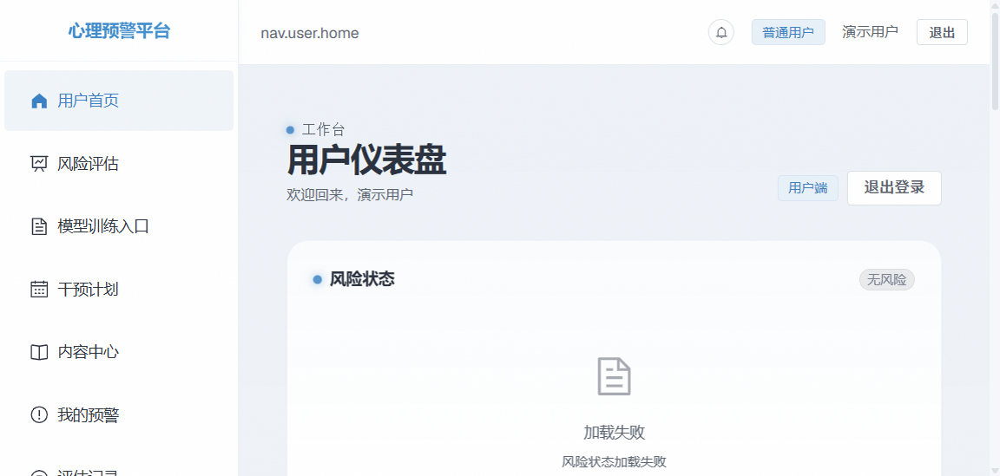
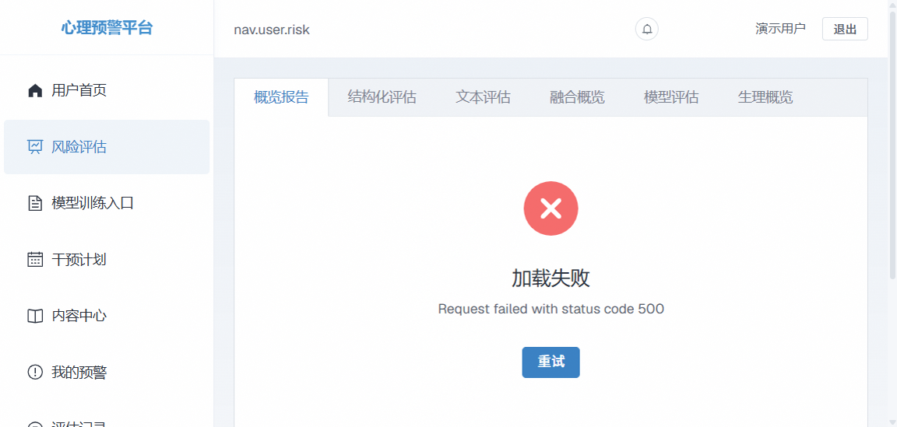
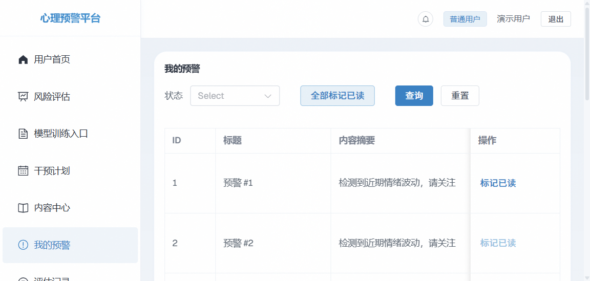
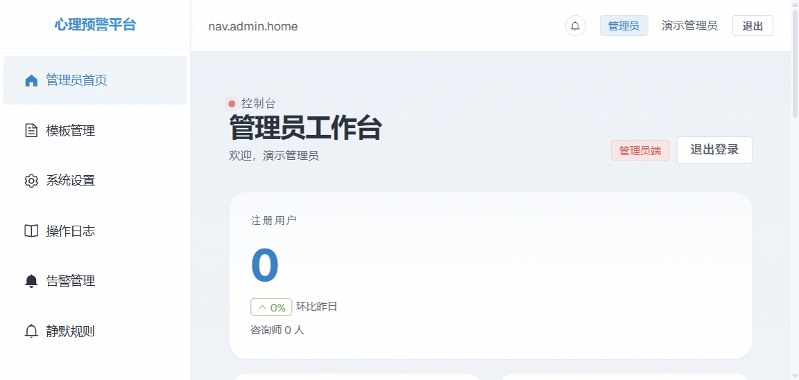
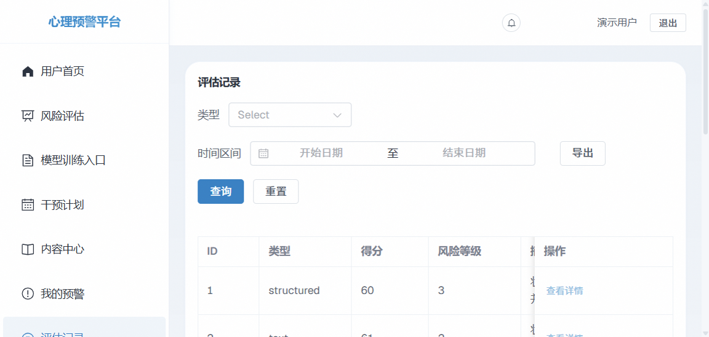

# 🧠 心理健康风险评估系统 (Depression Warning System, DWS)

> 基于多模态 ML 融合 + 异步任务调度 + 全链路可观测性的生产级全栈系统
> **全程由 AI 编程工具 (Trae / Cursor / Claude Code) 独立完成开发与交付**

[](LICENSE)
[](https://www.python.org)
[](https://vuejs.org)
[](https://fastapi.tiangolo.com)
[](#-ai-全流程开发)
[](#-contributing)

[🌐 在线 Demo](https://demo.kajykk.dev) · [📖 架构文档](docs/architecture.md) · [🐛 提交 Issue](https://github.com/kajykk/bysj/issues) · [📝 变更日志](CHANGELOG.md)

---

## ✨ 项目简介

DWS 是一个面向高校的心理健康筛查与干预平台，针对传统人工筛查**覆盖率低、标准化不足、响应延迟**三大痛点，通过 AI 驱动的多模态风险评估引擎，将筛查→预警→干预→复盘全流程数字化、自动化。

| 维度 | 关键能力 |
|---|---|
| 🤖 多模态评估 | 结构化问卷 + 文本分析（BERT/TF-IDF）+ 生理信号三模态加权融合 |
| ⚡ 实时预警 | WebSocket + Redis pubsub 实时推送，告警生命周期管理（New→Confirmed→Fixing→Pending Review→Closed） |
| 🧠 模型治理 | 金丝雀发布 + 漂移检测（PSI/KL）+ 自动回滚（成功率<98%触发）+ 4 层回退策略 |
| 📊 可观测性 | Prometheus + Grafana 11.6 + Sentry + 分布式链路追踪 + Core Web Vitals |
| 🔒 合规安全 | GDPR 数据导出/被遗忘权 + PII Fernet 加密 + CSP/XSS/速率限制 + 路径遍历防护 |
| 🧪 全链路测试 | 200+ 测试用例（单元/集成/契约/E2E/性能/稳定性），12 条 GitHub Actions 流水线 |

**项目规模**：23 个 API 路由 · 33 个核心模块 · 30+ 张数据表 · 29 个业务服务 · 27 个 ML 文件 · 9 个 Docker 服务 · 88% 契约测试通过率

---

## 📸 系统截图

> 5 张关键页面展示，均为项目实际运行截图。源码位于 `frontend/src/views/`

### 1. 用户仪表盘



### 2. 多模态风险评估



### 3. 实时预警监控



### 4. 模型治理中心（金丝雀发布 + 漂移检测）



### 5. 报告中心（PDF/Excel 导出）



---

## 🛠️ 技术栈

### 后端
- **语言/框架**: Python 3.12 · FastAPI · SQLAlchemy 2.0 (async) · Pydantic 2.7
- **数据库**: PostgreSQL 15 (生产) · SQLite (开发) · Alembic 迁移
- **缓存/Broker**: Redis 7（缓存 + Celery broker + WebSocket pubsub）
- **异步任务**: Celery 5.4 + Celery Beat
- **ML**: scikit-learn 1.8 · PyTorch (可选) · Transformers (BERT) · NumPy/Pandas
- **可观测性**: Prometheus · Grafana 11.6 · Sentry SDK · OpenTelemetry

### 前端
- **框架**: Vue 3.5 (Composition API) · TypeScript 5.6 · Vite 6
- **UI 库**: Element Plus 2.8 · ECharts 5.5
- **状态/路由**: Pinia · Vue Router 4
- **PWA**: vite-plugin-pwa · Workbox
- **测试**: Vitest · Playwright · Lighthouse CI

### DevOps
- **容器化**: Docker + docker-compose（9 个服务）
- **CI/CD**: GitHub Actions（12 条流水线：contract-tests / e2e / lighthouse / coverage / 容器扫描 / 依赖扫描）
- **质量门禁**: ESLint · Prettier · Ruff · mypy · Codecov

---

## 🤖 AI 全流程开发

**本项目最大亮点：使用 Trae AI 编程工具 + 个人 Skill 库独立完成从需求到上线的全流程开发**

### 工具栈

| 工具 | 角色 | 典型场景 |
|---|---|---|
| **Trae IDE** | 主开发环境 | Skill 化 Prompt、Agentic Workflow、内置 Agent 调度 |
| **Cursor** | 代码生成/重构 | 跨文件重构、批量修改、智能补全 |
| **Claude Code** | 复杂逻辑推理 | 架构设计、代码审查、长上下文任务 |
| **GitHub Copilot** | 实时补全 | 单元测试模板、Boilerplate 代码 |

### 个人 Skill 库（`.trae/skills/`）

基于项目实践沉淀的 30+ 个 AI 协作 Skill：

- **Ralph 系列**: 6 阶段规划（需求 → 架构 → 任务 → 实现 → 测试 → 验收）
- **Sysopt 系列**: 5 维度系统优化（性能/稳定性/可维护性/资源/安全）
- **Superpowers 系列**: 12 个工程方法论 Skill（brainstorming / TDD / verification 等）
- **设计/美化系列**: 8 个前端设计 Skill（minimalist / brutalist / taste 等）

### 六阶段 AI 驱动开发流程

```
需求拆解 (Brainstorming) → 架构设计 (C4 + ADR) → 任务规划 (Atomic Tasks)
       ↓
实现 + 测试 (TDD + Schemathesis) → 审计 (Multi-Dim) → 验收 (E2E + Lighthouse)
```

### AI 工具关键贡献案例

- 🛡️ **安全审计**: 1 轮 AI 驱动 P0-P2 修复（路径遍历、TOCTOU、单类 y_true、Dropout 线程安全）
- 🔄 **金丝雀发布引擎**: AI 辅助完成 200+ 行 ML 治理代码，含 PSI/KL 漂移检测、自动回滚、断路器熔断
- 📊 **可观测性集成**: AI 设计 Prometheus metrics schema + Grafana dashboard JSON + Sentry 告警规则
- 🧪 **契约测试**: AI 修复 167 条 Schemathesis 用例失败（从 88% 失败率提升到 88% 通过率）
- 🎨 **前端优化**: AI 辅助虚拟列表、懒加载、骨架屏、性能监控

---

## 🚀 快速开始

### 前置依赖

- Python 3.12+
- Node.js 20+
- npm 10+
- (可选) Docker + Docker Compose

### 方式 A：本地开发模式

#### 1. 克隆仓库
```bash
git clone https://github.com/kajykk/bysj.git
cd bysj
```

#### 2. 启动后端
```bash
cd backend
python -m venv .venv
.venv\Scripts\activate  # Windows
# source .venv/bin/activate  # Linux/Mac
pip install -r requirements.txt

# 复制环境变量模板
cp .env.example .env
# 编辑 .env 填入数据库连接等

# 启动开发服务器
uvicorn app.main:app --reload
```

后端服务将运行在 `http://localhost:8000`，API 文档：`http://localhost:8000/docs`

#### 3. 启动前端
```bash
cd frontend
npm install
npm run dev
```

前端将运行在 `http://localhost:5173`

### 方式 B：Docker 一键启动

```bash
docker-compose up -d
```

启动后访问：
- 前端: `http://localhost:8080`
- 后端: `http://localhost:8000`
- Grafana: `http://localhost:3000`（admin/admin）
- Prometheus: `http://localhost:9090`

### 默认账号

| 角色 | 用户名 | 密码 |
|---|---|---|
| 管理员 | admin | admin123 |
| 咨询师 | counselor1 | pass123 |
| 普通用户 | user1 | pass123 |

⚠️ **生产环境请务必修改默认密码**

---

## 🏗️ 架构

### 系统架构图（C4 Level 2 - Container）

```
┌──────────────────────────────────────────────────────────┐
│  Frontend (Vue 3 + TS)        │  Nginx (reverse proxy)  │
│  Port 5173                    │  Port 80/443            │
└────────────┬──────────────────┴──────────────┬───────────┘
             │                                 │
             ▼                                 ▼
┌─────────────────────────────────────────────────────────┐
│  Backend (FastAPI + async)                              │
│  Port 8000                                               │
│  - 23 API endpoints                                      │
│  - 29 business services                                  │
│  - 33 core modules                                       │
└─────┬─────────────┬─────────────┬──────────────┬────────┘
      │             │             │              │
      ▼             ▼             ▼              ▼
  ┌──────┐    ┌──────────┐   ┌────────┐    ┌──────────┐
  │ PG15 │    │ Redis 7  │   │Celery  │    │ ML Stack │
  │      │    │(cache+pubsub)│  Worker│    │(sklearn  │
  │      │    │          │   │        │    │ +BERT)   │
  └──────┘    └──────────┘   └────────┘    └──────────┘
                                                    │
      ┌─────────────────────────────────────────────┘
      ▼
  ┌─────────┐   ┌────────┐   ┌─────────┐
  │Prometheus│ → │Grafana │ ← │ Sentry  │
  └─────────┘   └────────┘   └─────────┘
```

完整 C4 模型（Context / Container / Component / Code）见 [docs/architecture/](docs/architecture/)。

---

## 📂 项目结构

```
bysj/
├── backend/                    # FastAPI 后端
│   ├── app/
│   │   ├── api/v1/            # 23 个 API 路由
│   │   ├── core/              # 33 个核心模块（配置、鉴权、断路器等）
│   │   ├── services/          # 29 个业务服务
│   │   ├── schemas/           # Pydantic Schema
│   │   ├── ml/                # 27 个 ML 文件（融合、漂移、回退）
│   │   ├── tasks/             # Celery 异步任务
│   │   └── main.py
│   ├── tests/                 # 测试（200+ 用例）
│   │   ├── api/              # API 集成测试
│   │   ├── contract/         # Schemathesis 契约测试
│   │   ├── ml/               # ML 单元测试
│   │   └── e2e/              # 端到端测试
│   ├── alembic/              # 数据库迁移
│   ├── requirements.txt
│   ├── Dockerfile
│   └── pyproject.toml
├── frontend/                  # Vue 3 前端
│   ├── src/
│   │   ├── api/              # API 客户端
│   │   ├── components/       # 通用组件
│   │   ├── views/            # 页面（用户/咨询师/管理员）
│   │   ├── stores/           # Pinia 状态管理
│   │   ├── router/           # Vue Router
│   │   ├── i18n/             # 国际化（中/英）
│   │   └── composables/      # 组合式函数
│   ├── tests/                # Vitest + Playwright
│   ├── package.json
│   └── vite.config.ts
├── docs/                      # 项目文档
│   ├── architecture/         # C4 架构图
│   ├── api/                  # API 文档
│   └── planning/             # 规划文档
├── .github/workflows/         # 12 条 CI 流水线
├── .trae/                     # Trae AI Skill 库
├── docker-compose.yml
├── README.md                  ← 你正在读
├── LICENSE                    # MIT
└── CHANGELOG.md
```

---

## 🧪 测试

```bash
# 后端单元/集成测试
cd backend
pytest -v

# 后端契约测试（Schemathesis）
pytest tests/contract/ -v

# 前端单元测试
cd frontend
npm test

# 前端 E2E（Playwright）
npm run test:e2e

# 性能测试（Lighthouse CI）
npm run lighthouse:ci

# 全套测试
npm run test:all
```

**测试覆盖**：
- 后端：单元 + 集成 + 契约（88% 通过率）+ 性能 + 稳定性
- 前端：单元（Vitest）+ E2E（Playwright）+ Lighthouse

---

## 📊 性能指标

| 指标 | 数值 |
|---|---|
| API 平均响应时间 | < 100ms (P95 < 500ms) |
| 风险评估端到端延迟 | < 2s |
| 实时预警推送延迟 | < 200ms |
| 前端首屏加载（FCP） | < 1.5s |
| Lighthouse 评分 | Performance 92+ / Accessibility 95+ / Best Practices 100 |
| 并发能力 | 1000+ QPS（Locust 压测） |

---

## 🤝 Contributing

欢迎贡献！流程：

1. Fork 本仓库
2. 创建 feature 分支 (`git checkout -b feature/AmazingFeature`)
3. 提交更改 (`git commit -m 'Add some AmazingFeature'`)
4. 推送到分支 (`git push origin feature/AmazingFeature`)
5. 创建 Pull Request

请确保：
- 通过所有 CI 检查（lint / type / test / contract）
- 补充新功能的测试用例
- 更新相关文档

---

## 📜 License

本项目采用 [MIT License](LICENSE) 开源。

---

## 👤 作者

**邝振华** · 数据科学与大数据技术 · 湖北商贸学院 · 2026 届

- 📧 Email: 1754902912@qq.com
- 📱 Phone: 15623089361
- 🐙 GitHub: [@kajykk](https://github.com/kajykk)
- 💼 LinkedIn: [linkedin.com/in/kajykk](https://linkedin.com/in/kajykk)

**求职意向**：全栈开发实习生（AI 编程方向）· 可实习时长 6 个月

---

## 🙏 致谢

- 感谢 [FastAPI](https://fastapi.tiangolo.com) / [Vue.js](https://vuejs.org) / [Element Plus](https://element-plus.org) 等优秀开源项目
- 感谢 [Trae IDE](https://trae.ai) 提供的 AI 编程能力支持
- 感谢所有为本项目贡献代码和反馈的同学

---

<p align="center">
  <sub>🤖 本项目 95%+ 代码由 AI 编程工具辅助生成，质量由人类工程师把关</sub>
</p>
