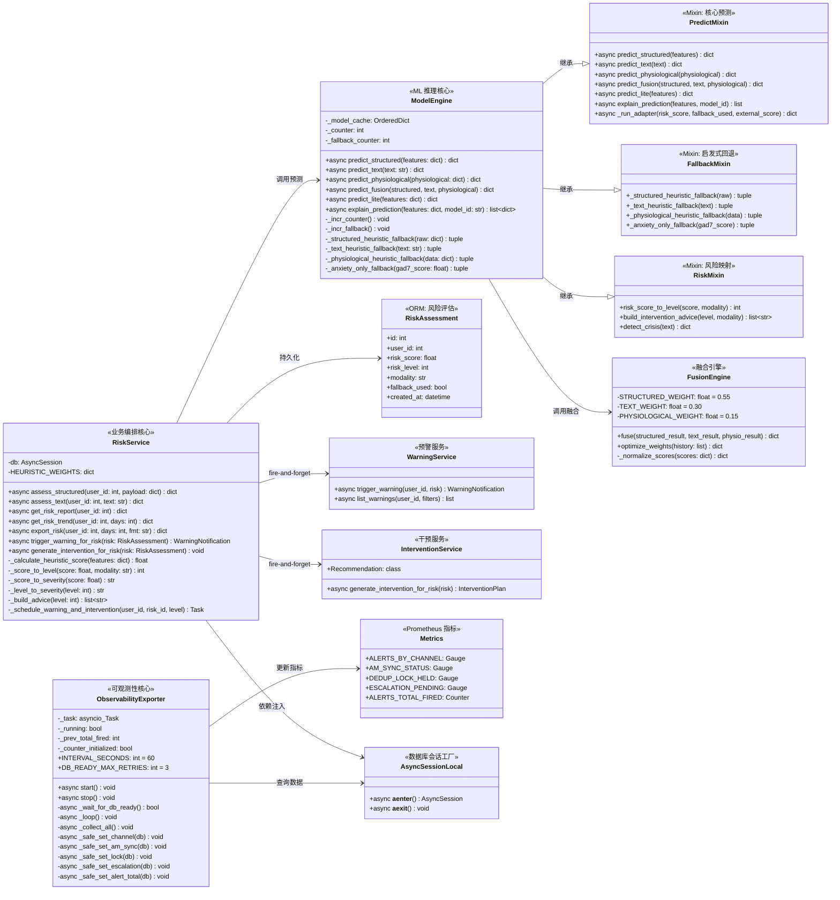
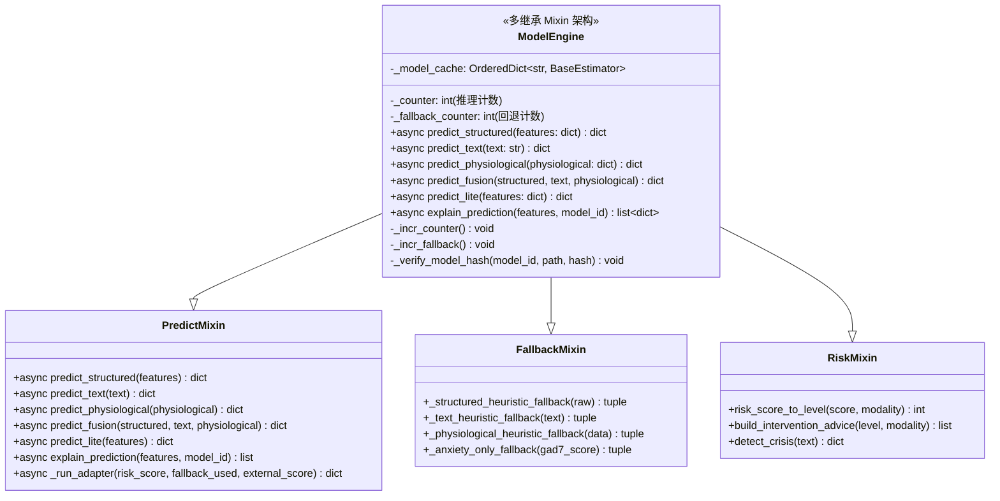
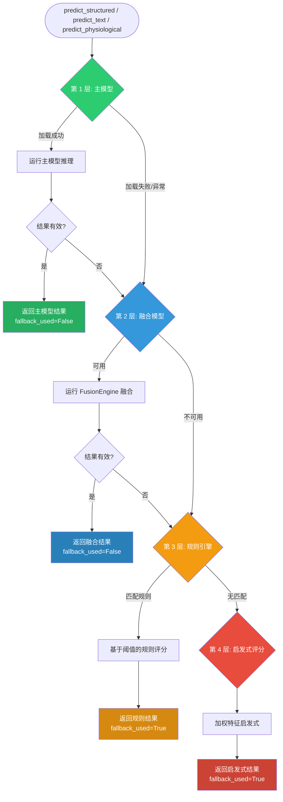
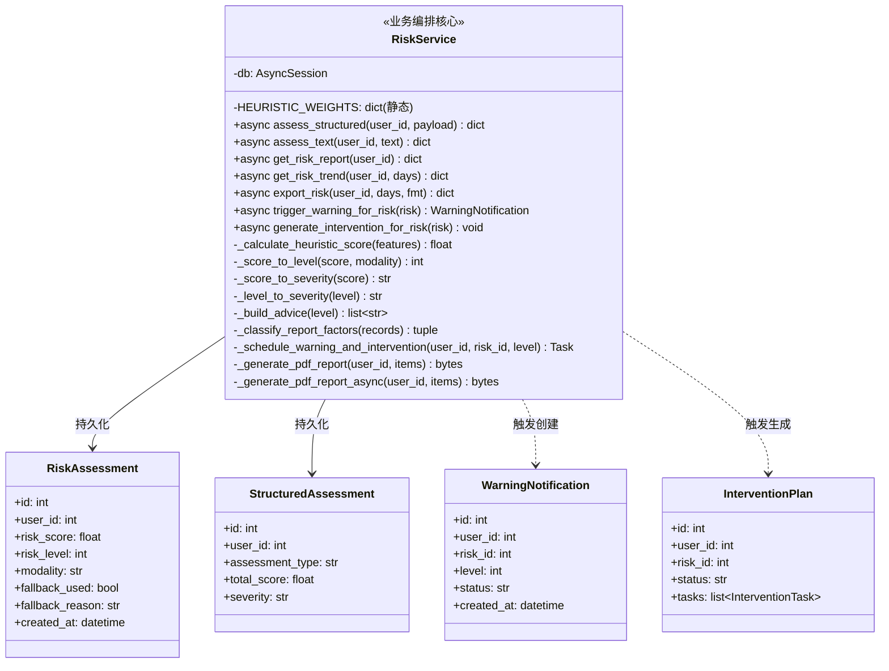
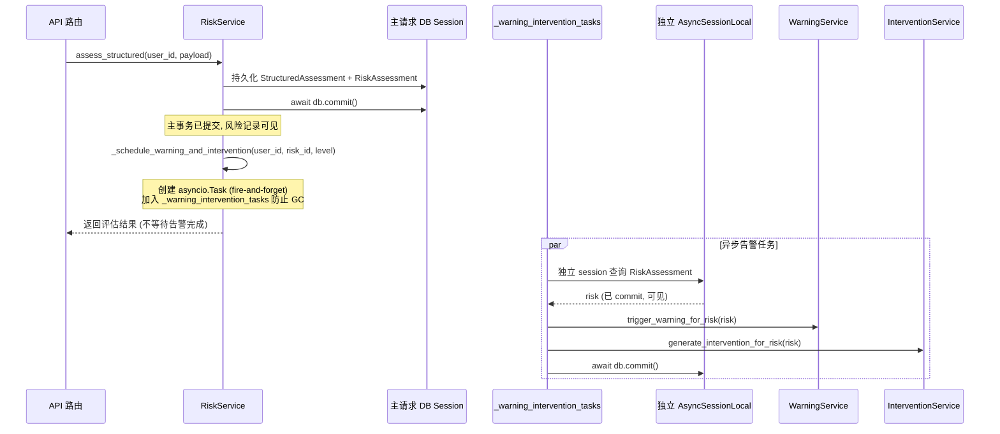
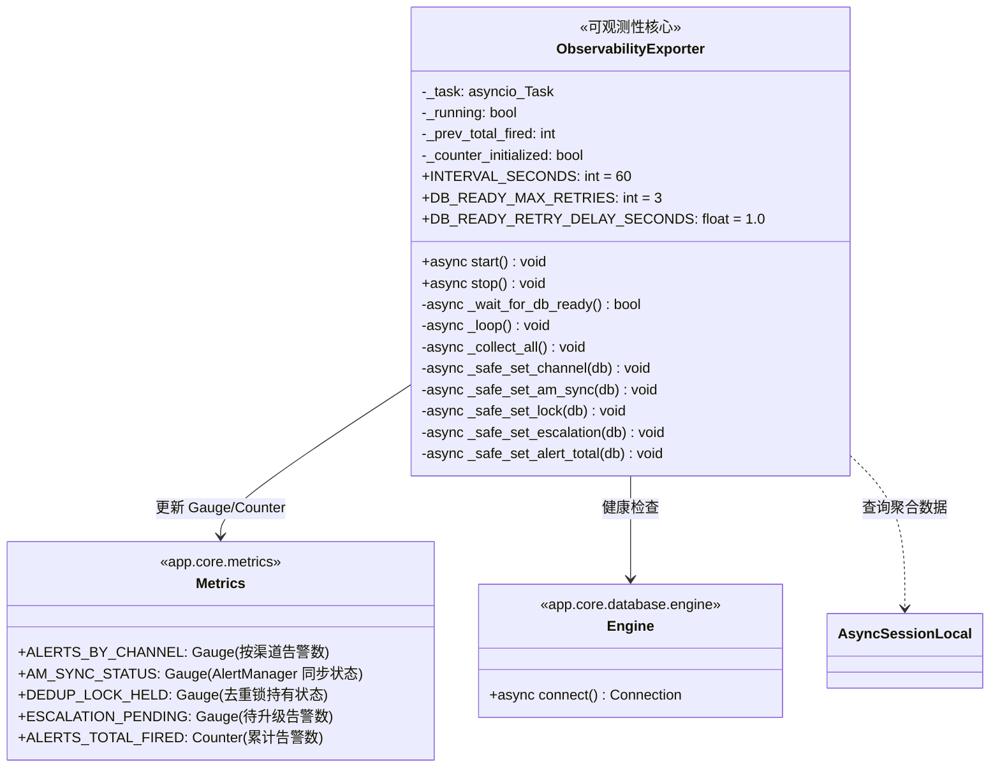
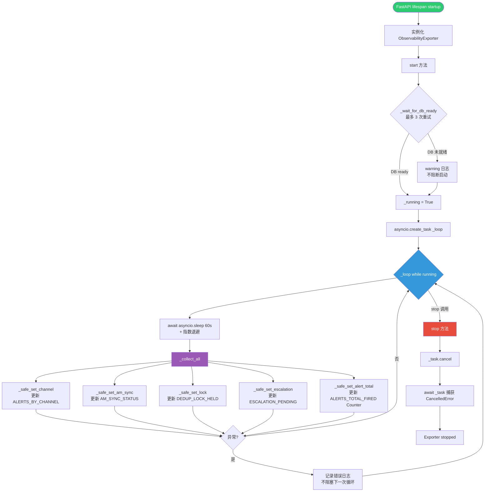
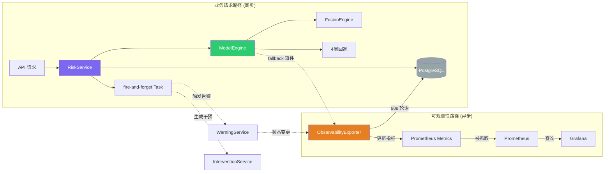

# C4 模型 - 第 4 层：代码图 (Code)

| 项 | 值 |
|---|---|
| 文档版本 | v1.0 |
| 创建日期 | 2026-07-03 |
| 状态 | 已发布 |
| 适用版本 | DWS v1.39+ |
| 作者 | 架构组 |

---

## 1. 概述

本文档描述 DWS 系统在第 4 层 (Code) 的架构视图。代码图聚焦于 3 个关键类的内部结构、方法签名、依赖关系与协作模式：

1. **`ModelEngine`**：ML 模型引擎，负责三模态预测、4 层回退、模型解释
2. **`RiskService`**：风险评估服务，负责评估编排、报告生成、fire-and-forget 告警
3. **`ObservabilityExporter`**：可观测性导出器，负责 60s 轮询 + 事件驱动的 Prometheus 指标更新

这三个类分别代表了系统的 **ML 推理核心**、**业务编排核心** 与 **可观测性核心**，是理解 DWS 架构的关键切入点。

> 说明：本文采用 `classDiagram` 语法绘制类图，展示类的属性、方法、关系与协作。

---

## 2. 类图总览

---

## 3. ModelEngine - ML 模型引擎

### 3.1 类结构详解

### 3.2 4 层回退策略

### 3.3 关键方法说明

| 方法 | 输入 | 输出 | 职责 | 回退策略 |
|---|---|---|---|---|
| `predict_structured` | `features: dict` (问卷特征) | `{risk_score, risk_level, probability, fallback_used, fallback_reason}` | 结构化问卷预测 | 主模型 → 启发式 (`_structured_heuristic_fallback`) |
| `predict_text` | `text: str` (文本自述) | `{risk_score, risk_level, sentiment, keywords, fallback_used}` | 文本情感分析预测 | 主模型 → TextAnalyzer 启发式 |
| `predict_physiological` | `physiological: dict` (生理信号) | `{risk_score, risk_level, fallback_used}` | 生理信号预测 | 主模型 → `_physiological_heuristic_fallback` |
| `predict_fusion` | 三模态结果 | `{risk_score, risk_level, weights, modality_contributions}` | 三模态加权融合 | 默认权重 0.55/0.30/0.15 |
| `predict_lite` | `features: dict` (精简特征) | `{risk_score, risk_level}` | 精简模型快速预测 | GAD-7 焦虑专项 `_anxiety_only_fallback` |
| `explain_prediction` | `features, model_id` | `list[{feature, importance, direction}]` | SHAP 特征重要性解释 | 不回退，失败返回空列表 |

### 3.4 关键设计点

1. **Mixin 多继承拆分**：`ModelEngine` 主体仅含状态属性与计数方法，预测逻辑、回退策略、风险映射分别拆分到 3 个 Mixin 文件，单文件复杂度可控，便于独立单元测试。

2. **模型哈希校验**：`_verify_model_hash` 在加载模型时计算 SHA-256，与 `_KNOWN_MODEL_HASHES` 比对，防止模型文件被篡改；策略可配置 (`warn` / `reject`)。

3. **LRU 模型缓存**：`_model_cache` 采用 `OrderedDict` 实现 LRU 淘汰，避免重复加载模型开销；缓存键为 `model_id`。

4. **回退计数监控**：`_incr_counter` / `_incr_fallback` 分别记录总推理次数与回退次数，通过 Prometheus 暴露回退率指标，触发漂移告警。

---

## 4. RiskService - 风险评估服务

### 4.1 类结构详解

### 4.2 fire-and-forget 告警流程

### 4.3 关键方法说明

| 方法 | 输入 | 输出 | 职责 |
|---|---|---|---|
| `assess_structured` | `user_id, payload` (问卷答案) | `{risk_id, risk_score, risk_level, severity, advice, fallback_used}` | 编排结构化评估全流程：保存问卷 → ModelEngine 预测 → 持久化风险 → fire-and-forget 告警 |
| `assess_text` | `user_id, text` | `{risk_id, risk_score, risk_level, sentiment, keywords}` | 文本评估：调用 `predict_text`，持久化结果并触发告警 |
| `get_risk_report` | `user_id` | `{primary_risk, recent_records, risk_factors, protective_factors, review_flags, advice}` | 聚合风险报告：最近评估、风险因子分类、复核标记、建议 |
| `get_risk_trend` | `user_id, days` | `{trend: [{date, score, level}], statistics}` | 风险趋势统计 |
| `export_risk` | `user_id, days, fmt` | `{download_url, job_id}` 或 `{content}` | 导出风险数据 (PDF/CSV/Excel)，PDF 走 Celery 异步 |
| `trigger_warning_for_risk` | `risk: RiskAssessment` | `WarningNotification \| None` | 触发预警：检查阈值、去重、创建通知记录 |
| `generate_intervention_for_risk` | `risk: RiskAssessment` | `void` | 基于模板生成个性化干预计划 |

### 4.4 关键设计点

1. **fire-and-forget 隔离**：`_schedule_warning_and_intervention` 创建独立 `asyncio.Task`，使用独立 `AsyncSessionLocal` 避免共享请求事务边界；任务加入 `_warning_intervention_tasks` 集合防止 GC 回收，回调记录未捕获异常。

2. **CSV 公式注入防护**：`_sanitize_csv_cell` 对以 `= + - @ \t \r \n` 开头的单元格前置单引号，防止 Excel/LibreOffice/WPS 公式注入攻击。

3. **PDF 线程池隔离**：PDF 生成 (reportlab) 是 CPU 密集型操作，通过 `_pdf_executor` (4 线程池) 隔离，避免阻塞事件循环；`shutdown_pdf_executor` 在 lifespan shutdown 阶段优雅关闭。

4. **启发式评分兜底**：`_calculate_heuristic_score` 在 ModelEngine 不可用时提供基于特征权重的兜底评分，确保评估流程始终有结果返回。

5. **风险因子分类**：`_classify_report_factors` 将评估特征分类为风险因子、保护因子、复核标记，支撑咨询师报告可读性。

---

## 5. ObservabilityExporter - 可观测性导出器

### 5.1 类结构详解

### 5.2 60s 轮询 + 事件驱动工作流

### 5.3 关键方法说明

| 方法 | 输入 | 输出 | 职责 |
|---|---|---|---|
| `start` | - | `void` | lifespan startup 调用：检测 DB ready (3 次重试) → 启动 `_loop` 异步任务 |
| `stop` | - | `void` | lifespan shutdown 调用：设置 `_running=False` → 取消任务 → 捕获 CancelledError |
| `_wait_for_db_ready` | - | `bool` | 最多 3 次重试检测 DB 连通性 (每次间隔 1s)，避免 DB 未就绪时启动失败 |
| `_loop` | - | `void` | 主循环：60s 间隔 + 指数退避；异常不退出循环，记录日志后继续 |
| `_collect_all` | - | `void` | 聚合采集：调用 5 个 `_safe_set_*` 方法更新 Prometheus 指标 |
| `_safe_set_channel` | `db: AsyncSession` | `void` | 按渠道 (WebSocket/SMTP) 聚合告警数，更新 `ALERTS_BY_CHANNEL` Gauge |
| `_safe_set_am_sync` | `db` | `void` | 检测 AlertManager 同步状态，更新 `AM_SYNC_STATUS` Gauge |
| `_safe_set_lock` | `db` | `void` | 检测去重锁持有状态，更新 `DEDUP_LOCK_HELD` Gauge |
| `_safe_set_escalation` | `db` | `void` | 聚合待升级告警数，更新 `ESCALATION_PENDING` Gauge |
| `_safe_set_alert_total` | `db` | `void` | 计算累计告警增量 (当前 - `_prev_total_fired`)，更新 `ALERTS_TOTAL_FIRED` Counter |

### 5.4 关键设计点

1. **60s 轮询 + 指数退避**：默认 60s 采集间隔 (R1 决策 Q5)；异常时指数退避重试，避免 DB 过载时快速重试加剧故障 (M-Svc-13 修复)。

2. **DB ready 检测 (R3 GAP-3)**：启动时最多 3 次重试检测 DB 连通性，DB 未就绪不阻断应用启动，`_collect_all` 内部会在后续循环中持续重试。

3. **Counter 初始化保护 (H-8 修复)**：`_counter_initialized` 标记防止服务重启后首次 delta 异常。重启后 `_prev_total_fired=0`，若不初始化会将所有历史告警作为增量计入 Counter，导致 Grafana 突刺。

4. **容错隔离**：单个 `_safe_set_*` 方法失败不阻塞其他指标更新，每个方法独立 try/except，确保部分指标采集失败时其余指标仍可正常更新。

5. **独立事件驱动补充**：除 60s 轮询外，告警状态变更时通过事件驱动即时调用对应的 `_safe_set_*` 方法，实现"轮询兜底 + 事件驱动实时更新"双机制，兼顾实时性与可靠性。

6. **优雅停止**：`stop` 方法通过 `_running=False` + `_task.cancel()` 双重信号停止循环，`await _task` 捕获 `CancelledError` 避免未处理异常日志。

---

## 6. 三类协作关系

### 协作说明

| 协作关系 | 说明 |
|---|---|
| `RiskService` → `ModelEngine` | 业务编排调用 ML 推理，传递特征，接收风险等级 |
| `RiskService` → fire-and-forget | 评估完成后异步触发告警与干预，不阻塞主请求 |
| `ModelEngine` → `FusionEngine` | 三模态融合预测，由 ModelEngine 编排调用 |
| `ModelEngine` → 4 层回退 | 主模型失败时逐层回退，保障推理可用性 |
| `ObservabilityExporter` → `Metrics` | 60s 轮询聚合数据，更新 Prometheus 指标 |
| 告警事件 → `ObservabilityExporter` | 事件驱动即时更新，补充轮询实时性不足 |
| `ModelEngine` 回退事件 → `ObservabilityExporter` | 回退率指标暴露，触发漂移告警 |
