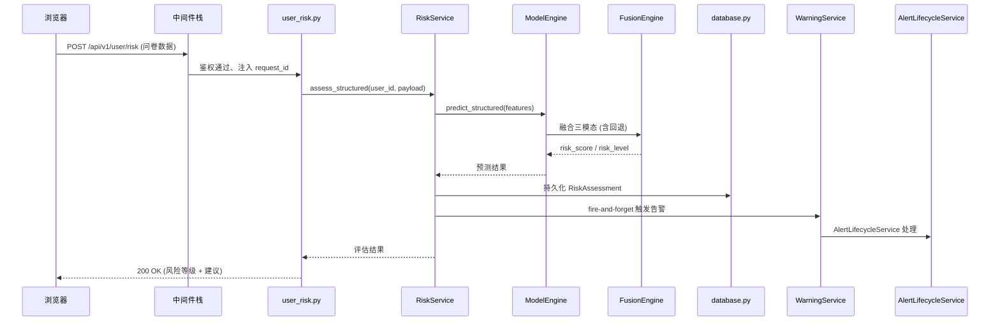
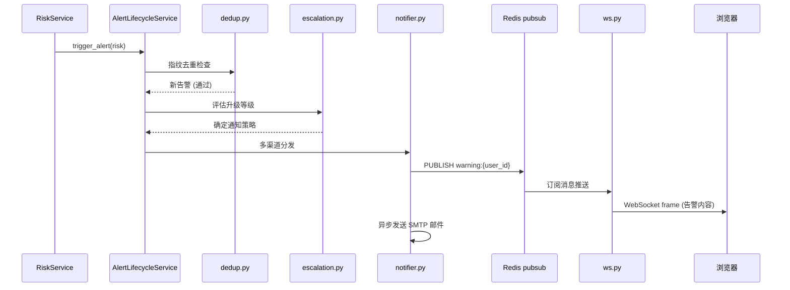

# C4 模型 - 第 3 层：组件图 (Component)

| 项 | 值 |
|---|---|
| 文档版本 | v1.0 |
| 创建日期 | 2026-07-03 |
| 状态 | 已发布 |
| 适用版本 | DWS v1.39+ |
| 作者 | 架构组 |

---

## 1. 概述

本文档描述 DWS 系统在第 3 层 (Component) 的架构视图。组件图聚焦于 **backend 容器** (FastAPI 应用) 内部的模块结构，展示 `api/v1`、`core`、`services`、`models`、`ml`、`tasks`、`monitoring`、`middleware` 等模块之间的依赖关系与职责划分。

> 说明：因 GitHub Mermaid 渲染器对 `C4Component` 语法支持不稳定，本文采用 `graph TD` 语法绘制组件图，表达同等语义。

---

## 2. 组件架构图

```mermaid
graph TD
    subgraph Client["客户端层"]
        Browser["浏览器<br/>(学生/咨询师/管理员)"]
    end

    subgraph Middleware["中间件层 (middleware/)"]
        MW_Monitor["monitoring.py<br/>请求指标/链路追踪"]
        MW_Security["security.py<br/>JWT 校验/CSRF/安全头"]
        MW_XSS["xss.py<br/>XSS 输入过滤"]
    end

    subgraph API["API 路由层 (api/v1/ - 33 个路由模块)"]
        API_Auth["auth.py<br/>登录/注册/Token"]
        API_Risk["user_risk.py<br/>风险评估提交"]
        API_Warning["user_warning.py + alerts.py<br/>预警查询/告警管理"]
        API_Intervention["user_intervention.py<br/>干预计划管理"]
        API_Reports["reports.py<br/>报告导出/PDF"]
        API_Admin["admin.py + admin_metrics.py<br/>用户管理/系统配置"]
        API_Counselor["counselor.py<br/>咨询师工作台"]
        API_Monitor["monitoring.py + metrics.py<br/>监控查询/指标暴露"]
        API_GDPR["gdpr.py<br/>数据导出/被遗忘权"]
        API_Canary["canary.py<br/>金丝雀发布管理"]
        API_Others["其他路由<br/>(uploads/review/silences/...)"]
    end

    subgraph Services["业务服务层 (services/ - 29 个服务)"]
        SVC_Risk["RiskService<br/>风险评估编排"]
        SVC_Warning["WarningService<br/>预警触发/查询"]
        SVC_Alert["AlertLifecycleService<br/>告警生命周期"]
        SVC_Intervention["InterventionService<br/>干预计划生成"]
        SVC_Auth["AuthService<br/>认证授权"]
        SVC_PDF["PdfReportService + PdfJobStore<br/>PDF 生成/任务存储"]
        SVC_Observability["ObservabilityExporter<br/>可观测性导出"]
        SVC_Canary["CanaryManager<br/>金丝雀发布管理"]
        SVC_GDPR["GdprService<br/>合规数据处理"]
        SVC_Others["其他服务<br/>(email/content/review/...)"]
    end

    subgraph Core["基础设施层 (core/ - 33 个模块)"]
        CORE_Config["config.py<br/>配置管理 (pydantic-settings)"]
        CORE_DB["database.py + db_breaker.py<br/>异步会话/熔断器"]
        CORE_Cache["cache.py<br/>Redis 缓存封装"]
        CORE_WS["ws.py<br/>WebSocket 连接管理"]
        CORE_Celery["celery_app.py + celery_async.py<br/>Celery 客户端"]
        CORE_ModelEngine["model_engine.py<br/>ML 模型引擎"]
        CORE_Metrics["metrics.py<br/>Prometheus 指标"]
        CORE_Security["security.py + pii_crypto.py<br/>JWT/加密/PII"]
        CORE_Health["health.py<br/>健康检查"]
        CORE_Fallback["fallback_hierarchy.py<br/>4层回退编排"]
        CORE_Others["其他 (logging/tracing/rate_limit/...)"]
    end

    subgraph ML["机器学习模块 (ml/ - 27 个文件)"]
        ML_Fusion["FusionEngine<br/>三模态融合引擎"]
        ML_Text["TextAnalyzer<br/>文本情感分析"]
        ML_Canary["canary_controller.py<br/>金丝雀路由"]
        ML_Drift["drift_detector.py<br/>漂移检测"]
        ML_Trainer["trainer.py + model.py<br/>模型训练/加载"]
        ML_Feature["feature_engineering.py<br/>特征工程"]
        ML_Others["其他 (data_cleaner/evaluation/...)"]
    end

    subgraph Models["数据模型层 (models/ - 10 个文件)"]
        ORM_User["user.py<br/>用户/角色/绑定"]
        ORM_Risk["risk.py<br/>风险评估/预警"]
        ORM_Assessment["assessment.py<br/>结构化评估"]
        ORM_Intervention["intervention.py<br/>干预计划/任务"]
        ORM_Others["其他 (audit/log/monitoring/...)"]
    end

    subgraph Tasks["异步任务层 (tasks/ - 6 个文件)"]
        TASK_PDF["pdf_report.py<br/>PDF 生成任务"]
        TASK_Training["model_training.py<br/>模型训练任务"]
        TASK_Anomaly["anomaly_detection.py<br/>异常检测"]
        TASK_Observability["observability.py<br/>可观测性聚合"]
        TASK_Scheduler["scheduler.py<br/>定时任务注册"]
    end

    subgraph Monitoring["告警管理 (monitoring/ - 7 个模块)"]
        MON_Alerting["alerting.py<br/>告警规则评估"]
        MON_Dedup["dedup.py<br/>告警去重"]
        MON_Escalation["escalation.py<br/>告警升级"]
        MON_Notifier["notifier.py<br/>多渠道通知"]
    end

    Browser -->|HTTP/WS| MW_Monitor
    MW_Monitor --> MW_Security
    MW_Security --> MW_XSS
    MW_XSS --> API_Auth

    API_Auth --> SVC_Auth
    API_Risk --> SVC_Risk
    API_Warning --> SVC_Warning
    API_Warning --> SVC_Alert
    API_Intervention --> SVC_Intervention
    API_Reports --> SVC_PDF
    API_Admin --> SVC_Others
    API_Counselor --> SVC_Others
    API_Monitor --> SVC_Observability
    API_GDPR --> SVC_GDPR
    API_Canary --> SVC_Canary

    SVC_Risk --> CORE_ModelEngine
    SVC_Risk --> SVC_Warning
    SVC_Risk --> SVC_Intervention
    SVC_Warning --> SVC_Alert
    SVC_Alert --> MON_Alerting
    MON_Alerting --> MON_Dedup
    MON_Alerting --> MON_Escalation
    MON_Notifier --> CORE_Cache
    SVC_PDF --> CORE_Celery
    SVC_Observability --> CORE_Metrics
    SVC_Canary --> ML_Canary
    SVC_GDPR --> CORE_Security

    CORE_ModelEngine --> CORE_Fallback
    CORE_ModelEngine --> ML_Fusion
    CORE_Fallback --> ML_Trainer
    ML_Fusion --> ML_Text
    ML_Canary --> ML_Drift
    ML_Trainer --> ML_Feature

    SVC_Risk --> ORM_Risk
    SVC_Warning --> ORM_Risk
    SVC_Intervention --> ORM_Intervention
    SVC_Auth --> ORM_User
    SVC_Auth --> ORM_Assessment
    CORE_DB --> ORM_User

    CORE_Celery --> TASK_PDF
    CORE_Celery --> TASK_Training
    CORE_Celery --> TASK_Anomaly
    CORE_Celery --> TASK_Observability
    TASK_Scheduler --> CORE_Celery

    CORE_ModelEngine --> CORE_DB
    CORE_ModelEngine --> CORE_Cache
    CORE_WS --> CORE_Cache
    SVC_Observability --> CORE_DB

    CORE_DB --> CORE_Config
    CORE_Cache --> CORE_Config
    CORE_Celery --> CORE_Config

    TASK_PDF --> SVC_PDF
    TASK_Training --> ML_Trainer
    TASK_Observability --> SVC_Observability

    classDef apiLayer fill:#4A90D9,stroke:#2C5F8D,color:#fff
    classDef svcLayer fill:#7B68EE,stroke:#4B3F9E,color:#fff
    classDef coreLayer fill:#2ECC71,stroke:#1F8B57,color:#fff
    classDef mlLayer fill:#E67E22,stroke:#A85C16,color:#fff
    classDef modelLayer fill:#95A5A6,stroke:#6B7B7C,color:#fff
    classDef taskLayer fill:#F39C12,stroke:#B3700C,color:#fff
    classDef monLayer fill:#E74C3C,stroke:#A83025,color:#fff
    classDef mwLayer fill:#34495E,stroke:#1F2A36,color:#fff

    class API_Auth,API_Risk,API_Warning,API_Intervention,API_Reports,API_Admin,API_Counselor,API_Monitor,API_GDPR,API_Canary,API_Others apiLayer
    class SVC_Risk,SVC_Warning,SVC_Alert,SVC_Intervention,SVC_Auth,SVC_PDF,SVC_Observability,SVC_Canary,SVC_GDPR,SVC_Others svcLayer
    class CORE_Config,CORE_DB,CORE_Cache,CORE_WS,CORE_Celery,CORE_ModelEngine,CORE_Metrics,CORE_Security,CORE_Health,CORE_Fallback,CORE_Others coreLayer
    class ML_Fusion,ML_Text,ML_Canary,ML_Drift,ML_Trainer,ML_Feature,ML_Others mlLayer
    class ORM_User,ORM_Risk,ORM_Assessment,ORM_Intervention,ORM_Others modelLayer
    class TASK_PDF,TASK_Training,TASK_Anomaly,TASK_Observability,TASK_Scheduler taskLayer
    class MON_Alerting,MON_Dedup,MON_Escalation,MON_Notifier monLayer
    class MW_Monitor,MW_Security,MW_XSS mwLayer
```

---

## 3. 模块清单

### 3.1 中间件层 (middleware/)

| 模块 | 职责 | 关键特性 |
|---|---|---|
| `monitoring.py` | 请求指标采集、分布式链路追踪 | 记录请求耗时/状态码；注入 request_id |
| `security.py` | JWT 校验、CSRF 防护、安全响应头 | Bearer Token 验证；CSP/HSTS/XSS-Protection |
| `xss.py` | XSS 输入过滤、CSP 报告接收 | 对用户输入做 HTML 转义；接收 `/csp-report` |

### 3.2 API 路由层 (api/v1/ - 33 个路由模块)

| 路由模块 | 职责 |
|---|---|
| `auth.py` | 登录/注册/Token 刷新/密码重置 |
| `user_risk.py` | 学生提交风险评估 (结构化/文本/生理) |
| `user_warning.py` + `alerts.py` | 预警通知查询、告警生命周期管理 |
| `user_intervention.py` | 干预计划查看、任务更新 |
| `reports.py` | 风险报告导出 (PDF/CSV/Excel) |
| `admin.py` + `admin_metrics.py` | 用户/角色管理、系统配置、管理指标 |
| `counselor.py` | 咨询师工作台、学生绑定 |
| `monitoring.py` + `metrics.py` | 监控查询、Prometheus 指标暴露 |
| `gdpr.py` | 数据导出、被遗忘权执行 |
| `canary.py` | 金丝雀发布管理、模型回滚 |
| 其他 | `uploads/review/silences/validation/user_content/user_data/user_upload/version/grafana_adapter` |

### 3.3 业务服务层 (services/ - 29 个服务)

| 服务 | 职责 | 关键方法 |
|---|---|---|
| `RiskService` | 风险评估编排 | `assess_structured()` / `get_risk_report()` / fire-and-forget 告警 |
| `WarningService` | 预警触发与查询 | 告警去重、阈值检查 |
| `AlertLifecycleService` | 告警生命周期管理 | 去重/升级/静默/关闭 |
| `InterventionService` | 干预计划生成 | 基于模板生成个性化任务 |
| `AuthService` | 认证授权 | JWT 签发/校验、权限矩阵 |
| `PdfReportService` + `PdfJobStore` | PDF 报告生成与任务存储 | reportlab 生成、Celery 异步 |
| `ObservabilityExporter` | 可观测性导出 | 60s 轮询 + 事件驱动、Prometheus 指标 |
| `CanaryManager` | 金丝雀发布管理 | 流量分配、自动回滚 |
| `GdprService` | 合规数据处理 | 数据导出、匿名化删除 |
| 其他 | `email/content/review/counselor/admin/excel_export/...` | - |

### 3.4 基础设施层 (core/ - 33 个模块)

| 模块 | 职责 |
|---|---|
| `config.py` | 配置管理 (pydantic-settings，环境变量注入) |
| `database.py` + `db_breaker.py` | 异步数据库会话、数据库熔断器 |
| `cache.py` | Redis 缓存封装 (get/set/delete/锁) |
| `ws.py` | WebSocket 连接管理 (Redis pubsub 后端) |
| `celery_app.py` + `celery_async.py` | Celery 客户端、异步任务投递 |
| `model_engine.py` | ML 模型引擎 (三模态预测、4 层回退) |
| `metrics.py` | Prometheus 指标定义 (Gauge/Counter/Histogram) |
| `security.py` + `pii_crypto.py` | JWT、密码哈希、PII 字段 AES 加密 |
| `health.py` | 健康检查端点 (DB/Redis/Celery 状态) |
| `fallback_hierarchy.py` | 4 层回退编排 |
| 其他 | `logging/tracing/rate_limit/sentry/contracts/...` |

### 3.5 机器学习模块 (ml/ - 27 个文件)

| 模块 | 职责 |
|---|---|
| `FusionEngine` | 三模态加权融合 (默认 0.55/0.30/0.15) |
| `TextAnalyzer` | 文本情感分析、关键词提取 |
| `canary_controller.py` | 金丝雀流量路由 |
| `drift_detector.py` | 数据/模型漂移检测 |
| `trainer.py` + `model.py` | 模型训练、加载、持久化 |
| `feature_engineering.py` | 特征工程、特征映射 |
| 其他 | `data_cleaner/data_loader/evaluation/statistical_tests/...` |

### 3.6 数据模型层 (models/ - 10 个文件, 30+ 张表)

| 模块 | 主要表 |
|---|---|
| `user.py` | User / Role / UserRole / UserCounselorBinding |
| `risk.py` | RiskAssessment / WarningNotification / WarningSetting |
| `assessment.py` | StructuredAssessment |
| `intervention.py` | InterventionPlan / InterventionTask / InterventionTemplate |
| 其他 | 审计日志、操作日志、监控日志、模型注册、金丝雀记录等 |

### 3.7 异步任务层 (tasks/ - 6 个文件)

| 任务模块 | 职责 | 触发方式 |
|---|---|---|
| `pdf_report.py` | PDF 报告生成 | API 投递 (fire-and-forget) |
| `model_training.py` | 模型训练 | 管理员手动触发 / 实验流程 |
| `anomaly_detection.py` | 异常检测 | 定时调度 |
| `observability.py` | 可观测性聚合 | 定时调度 |
| `scheduler.py` | 定时任务注册 | Beat 调度 |
| `alerts.py` | 告警相关异步处理 | 事件驱动 |

### 3.8 告警管理 (monitoring/ - 7 个模块)

| 模块 | 职责 |
|---|---|
| `alerting.py` | 告警规则评估、阈值判断 |
| `dedup.py` | 告警去重 (基于指纹 + 时间窗口) |
| `escalation.py` | 告警升级 (未处理告警逐级上报) |
| `notifier.py` | 多渠道通知 (WebSocket + SMTP) |

---

## 4. 关键调用链路

### 4.1 风险评估调用链

### 4.2 实时预警推送链

---

## 5. 关键设计点

1. **分层架构严格解耦**：API 路由层仅做参数校验与编排，业务逻辑下沉到 Services 层；Services 层依赖 Core 基础设施与 ML 引擎；ORM 模型层独立，避免循环依赖。

2. **ModelEngine 混入 (Mixin) 拆分**：`ModelEngine` 通过多继承 `PredictMixin + FallbackMixin + RiskMixin` 拆分到 3 个文件 (`model_engine_predict.py` / `model_engine_fallback.py` / `model_engine_risk.py`)，降低单文件复杂度，便于独立测试。

3. **fire-and-forget 告警**：`RiskService` 在持久化风险后，通过 `_schedule_warning_and_intervention` 异步触发告警与干预生成，不阻塞主请求事务；使用独立 `AsyncSessionLocal` 避免共享事务边界。

4. **熔断器分层保护**：
   - `db_breaker.py`：数据库熔断，避免 DB 故障时拖垮 API
   - `celery_breaker.py`：Celery 熔断，避免 Broker 故障反压
   - `smtp_breaker.py`：SMTP 熔断，避免邮件服务故障阻塞
   - `ml_breaker.py`：ML 推理熔断，触发 4 层回退

5. **可观测性事件驱动改造**：`ObservabilityExporter` 既支持 60s 轮询兜底，又支持事件驱动即时更新 (告警状态变更时主动推送 Prometheus 指标)，兼顾实时性与可靠性。

6. **告警生命周期独立模块**：`monitoring/` 目录独立于 `services/`，专门处理告警的去重、升级、静默、通知，避免业务服务层被告警逻辑污染。

7. **异步任务双层投递**：
   - **API 即时投递**：业务流程中通过 `celery_async.py` 投递 PDF 生成等任务
   - **Beat 定时投递**：`scheduler.py` 注册漂移检测、金丝雀监控等周期任务
   两条链路通过同一 Redis broker 汇聚到 celery-worker 执行。
