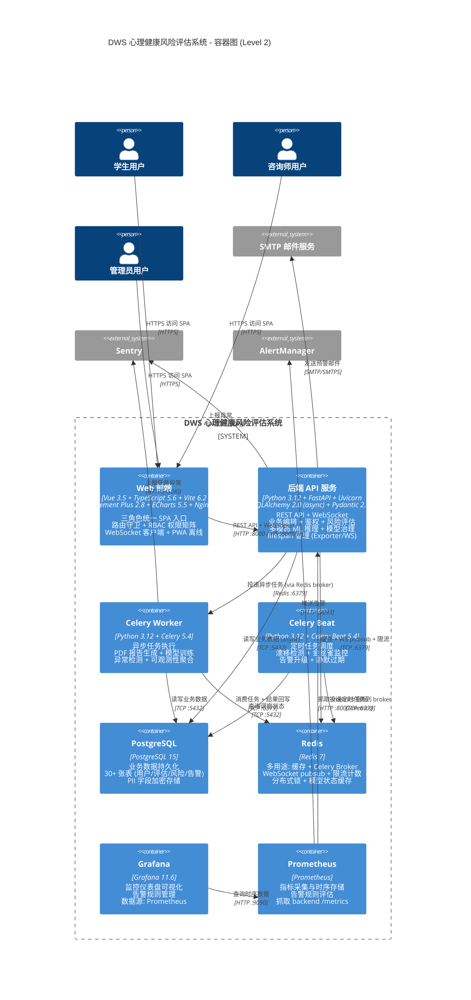
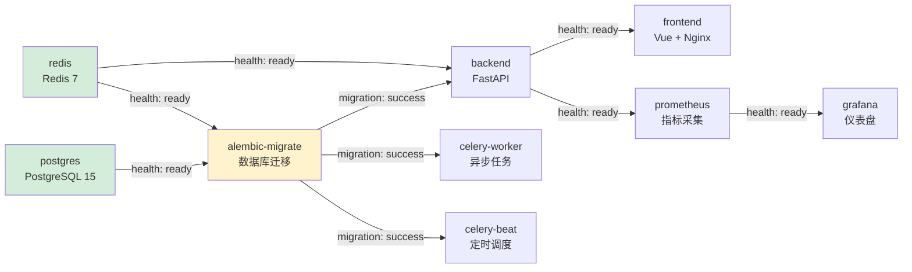

# C4 模型 - 第 2 层：容器图 (Container)

| 项 | 值 |
|---|---|
| 文档版本 | v1.0 |
| 创建日期 | 2026-07-03 |
| 状态 | 已发布 |
| 适用版本 | DWS v1.39+ |
| 作者 | 架构组 |

---

## 1. 概述

本文档描述 DWS 系统在第 2 层 (Container) 的架构视图。容器图将系统拆分为一组可独立部署、可独立扩展的容器 (进程/服务)，展示各容器的技术栈、端口、职责及相互依赖关系。

DWS 通过 `docker-compose.yml` 编排 **9 个容器服务**，覆盖前端、后端、数据存储、异步任务、监控可观测性等完整生命周期。

---

## 2. 容器架构图

---

## 3. 容器清单

### 3.1 应用层容器

| 容器 | 技术栈 | 端口 | 职责 |
|---|---|---|---|
| **frontend** | Vue 3.5 + TypeScript 5.6 + Vite 6.2 + Element Plus 2.8 + ECharts 5.5 + Nginx | 80 (对外) | 三角色统一 SPA 入口；路由守卫 + RBAC 权限矩阵；WebSocket 客户端实时接收预警；PWA 离线支持；ECharts 风险趋势可视化 |
| **backend** | Python 3.12 + FastAPI + Uvicorn + SQLAlchemy 2.0 (async) + Pydantic 2.7 | 8000 | REST API (23 个路由) + WebSocket；业务编排、JWT 鉴权、风险评估、告警生命周期管理；多模态 ML 推理 (FusionEngine) + 模型治理；lifespan 管理 ObservabilityExporter 与 WS 连接管理 |
| **celery-worker** | Python 3.12 + Celery 5.4 | - | 异步任务执行：PDF 报告生成 (reportlab)、模型训练、异常检测、可观测性聚合、告警升级检查 |
| **celery-beat** | Python 3.12 + Celery Beat 5.4 | - | 定时任务调度：漂移检测、金丝雀监控、告警升级、静默过期、模型状态轮询 |

### 3.2 数据层容器

| 容器 | 技术栈 | 端口 | 职责 |
|---|---|---|---|
| **postgres** | PostgreSQL 15 | 5432 | 业务数据持久化；30+ 张表 (用户/角色/评估/风险/告警/干预/审计日志)；PII 字段 AES 加密；异步 SQLAlchemy ORM |
| **redis** | Redis 7 | 6379 | 多用途基础设施：① 应用缓存 (热点查询/会话) ② Celery broker (任务队列) ③ WebSocket pubsub (实时推送) ④ 限流计数 ⑤ 分布式锁 ⑥ 模型状态缓存 |

### 3.3 监控层容器

| 容器 | 技术栈 | 端口 | 职责 |
|---|---|---|---|
| **grafana** | Grafana 11.6 | 3000 | 监控仪表盘可视化；告警规则管理；数据源：Prometheus；预置仪表盘：系统健康、模型性能、告警概览 |
| **prometheus** | Prometheus | 9090 | 指标采集与时序存储；告警规则评估；抓取 backend `/metrics` 端点 (15s 间隔) |

### 3.4 一次性容器

| 容器 | 技术栈 | 触发时机 | 职责 |
|---|---|---|---|
| **alembic-migrate** | Python 3.12 + Alembic | 容器启动时 (依赖 postgres 健康) | 执行数据库迁移 (upgrade head)；迁移完成后退出；幂等执行 |

---

## 4. 依赖与数据流

### 4.1 启动依赖顺序

### 4.2 主要数据流

| 数据流 | 路径 | 说明 |
|---|---|---|
| **评估请求流** | 浏览器 → frontend (Nginx :80) → backend (:8000) → postgres (:5432) | 学生提交问卷，backend 调用 ModelEngine 评估，结果落库 |
| **ML 推理流** | backend → ModelEngine → FusionEngine → (可选 PyTorch/Transformers) | 三模态融合预测，4 层回退保障可用性 |
| **实时预警流** | backend → redis (pubsub) → WebSocket → frontend → 浏览器 | 风险超阈值时，通过 Redis pubsub 广播，WebSocket 实时推送 |
| **异步任务流** | backend → redis (broker) → celery-worker → postgres + redis | PDF 报告生成、模型训练等长任务异步化 |
| **定时调度流** | celery-beat → redis (broker) → celery-worker | Beat 投递定时任务，Worker 消费执行 |
| **指标采集流** | backend (/metrics) → prometheus (scrape) → grafana (query) | 15s 抓取间隔，Grafana 仪表盘可视化 |
| **告警通知流** | backend → smtp (邮件) + sentry (异常) | 业务告警通过 SMTP 发送邮件，异常通过 Sentry SDK 上报 |

### 4.3 端口映射

| 容器 | 内部端口 | 主机端口 | 暴露 | 说明 |
|---|---|---|---|---|
| frontend | 80 | 8080 | 对外 | Nginx 反向代理后端 API |
| backend | 8000 | 8000 | 对内 | REST API + WebSocket |
| postgres | 5432 | 5432 | 对内 | 数据库 |
| redis | 6379 | 6379 | 对内 | 缓存/消息队列 |
| grafana | 3000 | 3000 | 对内 | 仪表盘 |
| prometheus | 9090 | 9090 | 对内 | 指标查询 |
| celery-worker | - | - | 内部 | 无 HTTP 端口 |
| celery-beat | - | - | 内部 | 无 HTTP 端口 |
| alembic-migrate | - | - | 一次性 | 迁移后退出 |

---

## 5. 关键设计点

1. **前端 Nginx 反代**：frontend 容器内置 Nginx，对外暴露 :80，将 `/api/*` 与 `/ws` 反向代理到 backend :8000，实现前后端同源部署，避免 CORS 问题。

2. **Redis 多角色复用**：单一 Redis 实例承担缓存、消息队列、pubsub、限流、锁 5 种角色，降低运维复杂度；生产环境可通过 Redis Cluster 或多实例拆分职责。

3. **Celery 双容器分离**：Worker (任务执行) 与 Beat (调度) 分离部署，便于独立扩缩容；Beat 单实例避免重复调度，Worker 多副本横向扩展。

4. **Alembic 一次性容器**：数据库迁移作为独立容器，启动时执行 `alembic upgrade head`，迁移成功后退出；通过 `depends_on: postgres (condition: service_healthy)` 保证迁移时数据库已就绪。

5. **监控栈独立可观测**：Prometheus + Grafana 独立部署，即使 DWS 业务系统故障，监控仪表盘仍可访问，便于故障诊断与恢复验证。

6. **健康检查链路**：每个容器配置 healthcheck，docker-compose 通过 `depends_on: condition: service_healthy` 实现有序启动，避免后端在数据库未就绪时启动失败。

7. **资源隔离**：backend 与 celery-worker 分离容器，避免长任务 (PDF 生成/模型训练) 阻塞 API 请求线程；CPU/内存资源可通过 docker-compose `deploy.resources` 独立限制。
