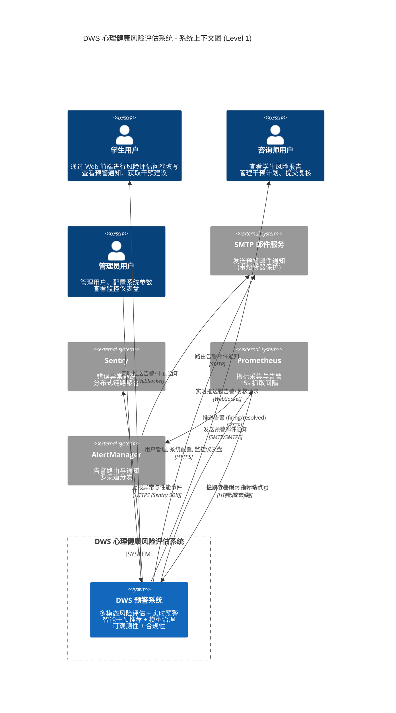

# C4 模型 - 第 1 层：系统上下文 (System Context)

| 项 | 值 |
|---|---|
| 文档版本 | v1.0 |
| 创建日期 | 2026-07-03 |
| 状态 | 已发布 |
| 适用版本 | DWS v1.39+ |
| 作者 | 架构组 |

---

## 1. 概述

本文档描述 **心理健康风险评估系统 (Depression Warning System, DWS)** 在第 1 层 (System Context) 的架构视图。该层聚焦于系统与外部参与者 (用户、外部系统) 之间的交互边界，不涉及系统内部实现细节。

DWS 是一个基于多模态融合的大学生抑郁症预警与干预系统，核心能力包括：
- **多模态风险评估**：结构化问卷 + 文本分析 + 生理信号三模态加权融合
- **实时预警通知**：WebSocket 实时推送 + 告警生命周期管理 + 多渠道通知
- **智能干预推荐**：基于风险等级与主导模态的个性化干预计划
- **模型治理**：金丝雀发布 + 漂移检测 + 自动回滚 + 4 层回退
- **可观测性**：Prometheus 指标 + Grafana 仪表盘 + Sentry 错误追踪 + 分布式链路
- **合规性**：GDPR 数据导出/被遗忘权 + PII 字段加密 + 审计日志

---

## 2. 系统上下文图

---

## 3. 参与者说明

### 3.1 用户角色

| 用户 | 角色职责 | 主要交互 | 通道 |
|---|---|---|---|
| 学生用户 | 风险评估数据提供者与预警接收者 | 填写结构化问卷 (PHQ-9/GAD-7)、提交文本自述、上传生理数据；查看个人风险趋势、预警通知、干预任务 | HTTPS + WebSocket |
| 咨询师用户 | 风险干预执行者与复核者 | 查看绑定学生风险报告、管理干预计划 (创建/更新任务)、提交风险评估复核、接收新告警推送 | HTTPS + WebSocket |
| 管理员用户 | 系统治理与运维者 | 用户/角色管理、系统参数配置、模型发布治理 (金丝雀)、监控仪表盘查看、告警静默管理 | HTTPS |

### 3.2 外部系统

| 外部系统 | 职责 | 交互方向 | 协议 | 备注 |
|---|---|---|---|---|
| SMTP 邮件服务 | 发送预警邮件通知给学生/咨询师 | DWS → SMTP | SMTP/SMTPS | 通过 `smtp_breaker` 熔断器保护，避免下游故障反压 |
| Sentry | 错误异常追踪、性能监控、崩溃报告 | DWS → Sentry | HTTPS (Sentry SDK) | 自动捕获未处理异常、慢事务追踪 |
| Prometheus | 指标采集与时序存储、告警规则评估 | Prometheus → DWS (scrape) | HTTP `/metrics` | 15s 抓取间隔；DWS 通过 `app.core.metrics` 暴露 Gauge/Counter/Histogram |
| AlertManager | 告警路由、去重、分组、多渠道通知 | Prometheus → AlertManager → SMTP | HTTP + SMTP | 告警生命周期与 DWS 内部 `AlertLifecycleService` 解耦 |

---

## 4. 系统边界与核心职责

### 4.1 系统边界

DWS 系统边界涵盖以下子系统的全部责任：

- **Web 前端** (Vue 3 SPA)：学生/咨询师/管理员的统一交互入口
- **后端 API 服务** (FastAPI)：业务编排、鉴权、风险评估、告警管理
- **异步任务调度** (Celery Worker + Beat)：PDF 报告生成、模型训练、异常检测、可观测性聚合
- **数据持久化** (PostgreSQL + Redis)：业务数据、缓存、消息队列、WebSocket pubsub
- **机器学习引擎** (scikit-learn/PyTorch)：三模态预测、融合、漂移检测、金丝雀发布
- **监控栈** (Grafana + Prometheus)：仪表盘可视化、告警可视化

### 4.2 核心职责清单

| 职责域 | 描述 |
|---|---|
| 多模态风险评估 | 接收结构化问卷、文本、生理信号三类输入，通过 FusionEngine 加权融合 (默认 0.55/0.30/0.15) 输出统一风险等级 |
| 实时预警 | 风险等级超阈值时触发告警，通过 WebSocket 实时推送 + SMTP 邮件多渠道通知 |
| 干预推荐 | 基于风险等级与主导模态，从模板库生成个性化干预计划 (任务列表) |
| 模型治理 | 金丝雀发布、漂移检测、自动回滚、4 层回退 (主模型 → 融合 → 规则 → 启发式) |
| 可观测性 | Prometheus 指标暴露、Grafana 仪表盘、Sentry 异常追踪、分布式链路 |
| 合规性 | GDPR 数据导出/被遗忘权、PII 字段加密 (AES)、操作审计日志 |

### 4.3 不在系统边界内

- **学校 SSO/统一身份认证**：当前版本使用本地账号体系，未接入校园 SO
- **第三方医疗机构系统**：不直接对接医院 HIS/EMR，仅支持人工导出报告
- **学生生理数据采集设备**：通过用户手动上传，不直连可穿戴设备 API

---

## 5. 关键设计点

1. **三角色统一入口**：学生、咨询师、管理员共享同一 Web 前端 SPA，通过 RBAC 权限矩阵 (路由守卫 + API 鉴权) 实现差异化视图，降低部署与维护成本。

2. **WebSocket 双向通信**：预警通知采用 WebSocket 实时推送 (Redis pubsub 后端)，相比轮询降低延迟与服务器负载；学生与咨询师均接收推送 (新告警、复核请求)。

3. **外部系统解耦**：
   - SMTP 通过熔断器 (`smtp_breaker`) 隔离，避免邮件服务故障导致主流程阻塞
   - Sentry SDK 采用异步上报，不影响业务请求路径
   - Prometheus 主动抓取模式，DWS 无需关心采集端可用性

4. **告警双链路**：
   - **业务告警**：DWS 内部 `AlertLifecycleService` 管理 (去重/升级/静默) → WebSocket + SMTP
   - **基础设施告警**：Prometheus 规则评估 → AlertManager → SMTP
   两条链路独立运行，分别覆盖业务风险与系统健康。

5. **合规性边界**：所有 PII 字段 (姓名、邮箱、文本自述) 在持久化前加密；GDPR 数据导出与被遗忘权由独立 API 实现，不影响主业务流程。
